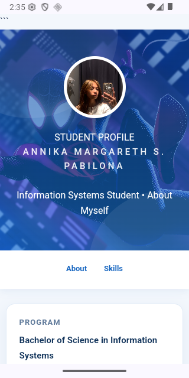
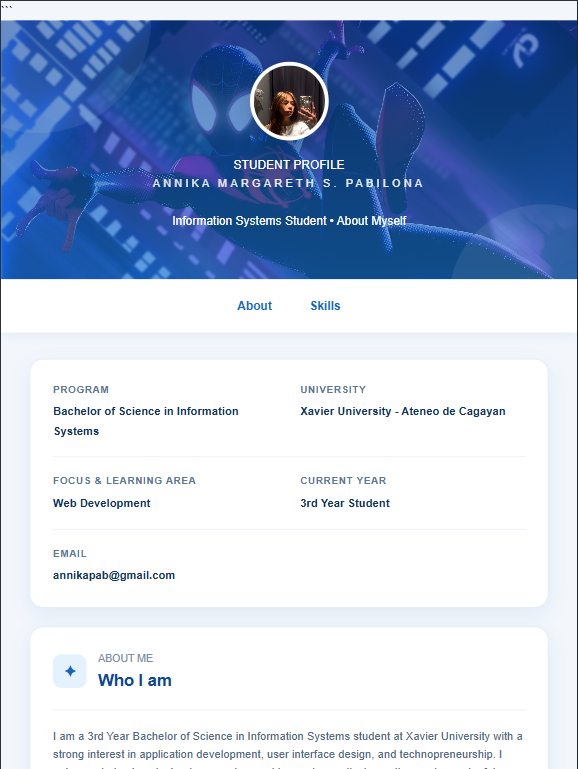
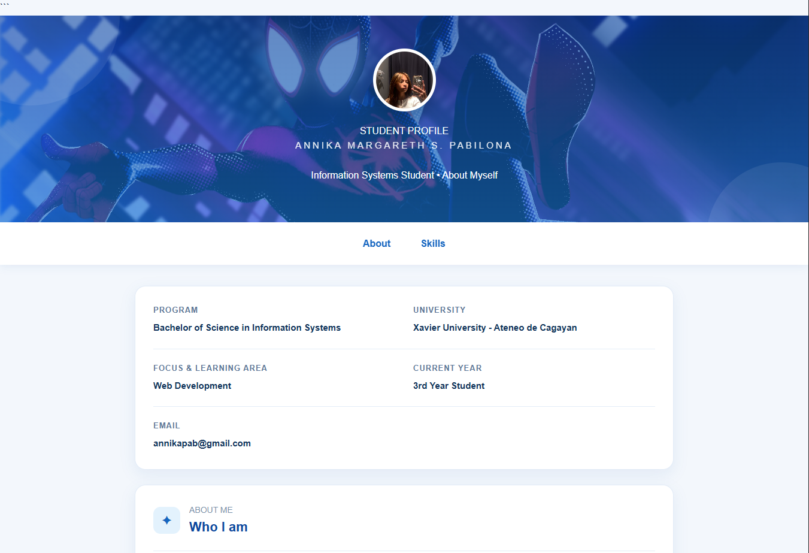
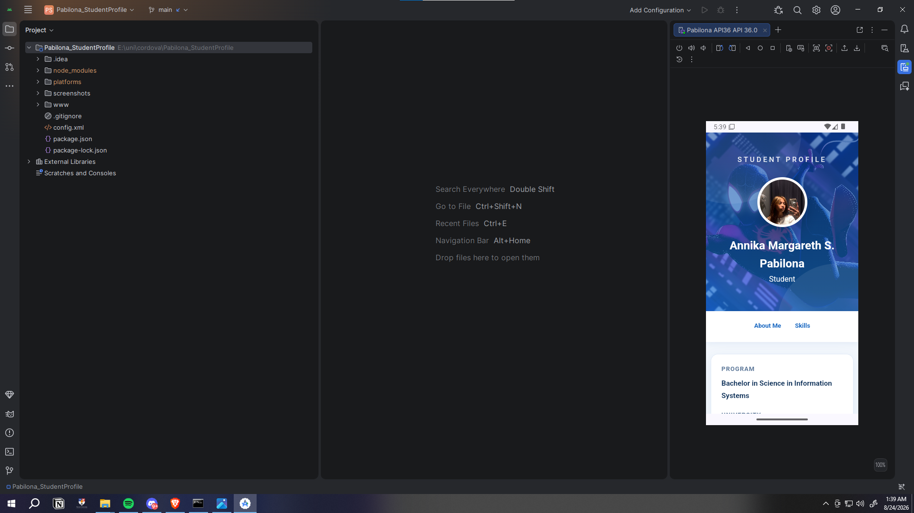

<<<<<<< HEAD
# Student Profile

## About the Project

This project is an improved version of my Student Profile from Module 3, Activity 2. For this activity, I applied the concepts and principles discussed in Module 4 about Mobile UI/UX Design.

The main goal was to improve the overall design and make the Student Profile more responsive and easier to use on different devices. Instead of designing only for one screen size, I adjusted the layout so that it can work properly on mobile phones, tablets, and desktop computers.

## Objectives

The main objectives of this activity are:

* Improve the original Student Profile design.
* Apply mobile UI/UX design principles.
* Make the website responsive on different screen sizes.
* Improve the spacing, alignment, and organization of the content.
* Make the profile easier to read and navigate.
* Make the interface more suitable for touch devices.

## Improvements Made

I made several changes to the original Student Profile based on the topics discussed in Module 4.

### Responsive Design

The layout was changed so that the content can adjust depending on the screen size. The mobile version uses a more vertical layout, while the tablet and desktop versions have more space for arranging the content.

### Better Spacing and Alignment

I adjusted the margins, padding, and spacing between sections to make the profile look less crowded and easier to read.

### Improved Visual Hierarchy

The student's name and important information are given more emphasis through font size, font weight, and section organization. This makes it easier to identify the important parts of the profile.

### Mobile-Friendly Design

Since the website can be viewed on a phone, I made sure that the buttons, text, images, and other elements are properly sized and spaced for a smaller screen.

### Organized Information

The student's information is separated into different sections instead of having everything displayed together. This makes the profile easier to scan and understand.

## Technologies Used

* HTML
* CSS
* JavaScript
* Apache Cordova
* Git and GitHub

## Project Structure

```text
Student-Profile/
│
├── www/
│   ├── css/
│   │   └── index.css
│   │
│   ├── js/
│   │   └── index.js
│   │
│   ├── img/
│   │   └── ...
│   │
│   └── index.html
│
├── config.xml
├── package.json
└── README.md
```

The exact files may be different depending on the final version of the project.

## How to Run

### Running the Website

The project can be opened directly through a web browser.

1. Download or clone the repository.
2. Open the project folder.
3. Go to the `www` folder.
4. Open `index.html` in a browser.

Another option is to use a local server. If Python is installed, run:

```bash
cd www
python -m http.server 8000
```

Then open `http://localhost:8000` in the browser.

### Running with Cordova

If Apache Cordova is installed, check the installation using:

```bash
cordova -v
```

If it is not installed yet:

```bash
npm install -g cordova
```

Go to the project folder:

```bash
cd Student-Profile
```

If Android has not been added yet:

```bash
cordova platform add android
```

To build the application:

```bash
cordova build android
```

To run it on an Android device or emulator:

```bash
cordova run android
```

### Note About `cordova serve`

I initially tried using `cordova serve`, but newer versions of Cordova do not recognize `serve` as a command.

If this error appears:

```text
Cordova does not know serve; try `cordova help` for a list of all the available commands.
```

the project can still be tested using the browser or a local server instead.

## Responsive Testing

I tested the design using different screen sizes to check how the layout changes between devices.

### Mobile

The mobile layout focuses on keeping the information readable and easy to scroll through.

Example sizes:

* 360 × 800
* 375 × 812
* 390 × 844
* 412 × 915

### Tablet

The tablet layout has more horizontal space, allowing the content to be arranged more comfortably.

Example sizes:

* 768 × 1024
* 820 × 1180

### Desktop

The desktop layout uses the wider screen while keeping the content organized and centered.

Example sizes:

* 1280 × 720
* 1366 × 768
* 1920 × 1080

I used Chrome DevTools to check how the website looks at different screen sizes.

## UI/UX Principles Applied

The following principles from Module 4 were applied to the redesign:

| Principle             | How I Applied It                                       |
| --------------------- | ------------------------------------------------------ |
| Responsive Design     | Made the layout adjust to different screen sizes       |
| Visual Hierarchy      | Made important information more noticeable             |
| Consistency           | Used consistent spacing and styling                    |
| Readability           | Adjusted text sizes and spacing                        |
| Accessibility         | Made content and buttons easier to see and use         |
| Touch-Friendly Design | Made interactive elements easier to tap                |
| Simplicity            | Avoided unnecessary elements and kept the layout clean |
| Organization          | Grouped related student information together           |

## Screenshots

Screenshots of the different layouts can be added here.

### Mobile

```text

```

### Tablet

```text

```

### Desktop

```text

```

## What I Learned

Through this activity, I learned that designing a website is not only about making it look good. It also needs to be easy to use on different devices.

I learned how responsive design can change the way content is arranged depending on the screen size. I also learned more about proper spacing, visual hierarchy, readability, and making interfaces easier to interact with on mobile devices.

Compared to my original Student Profile, I was able to make the design more responsive and organized while keeping the information simple and easy to access.

## Author

**Annika Pabilona**

Bachelor of Science in Information Systems
College of Computer Studies
Xavier University – Ateneo de Cagayan

## Activity

**Module 3 – Activity 2: Student Profile**
**Module 4 – Mobile UI/UX Design Principles**

This project was created for academic purposes.
=======
# Pabilona Student Profile - ITCC 41

Student Profile Page - Annika Pabilona

## App Preview


>>>>>>> ce57224313322cdaf6be1a213e2aa7a2398ed2a8
